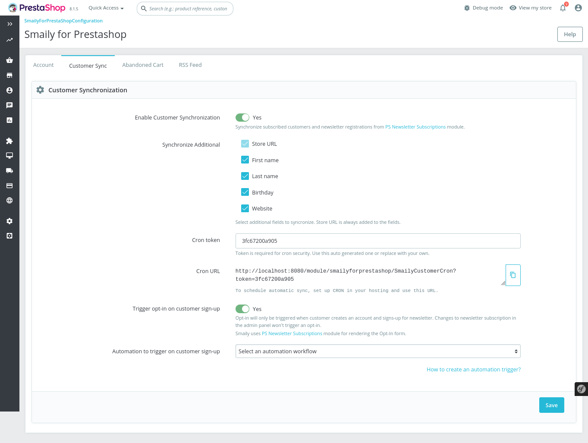

# USER GUIDE

This guide will help you set up and configure Smaily for PrestaShop module.

## Installation

1. You can get the **Smaily for PrestaShop module** from Smaily's [GitHub repository](https://github.com/sendsmaily/smaily-prestashop-module/releases).

2. Download the .zip file for the latest release. Extracted contents of the archive to a `smailyforprestashop` folder.

3. Upload the `smailyforprestashop` folder to your site's `/modules/` directory.

4. Navigate to **Modules -> Module Catalog**. Search for "smaily" and click **Install**.

## Connecting module to Smaily account

1. To start using Smaily extension navigate to **Modules -> Module Manager** section. On the configuration page, find **Smaily for PrestaShop**, then click on **Configure**.

2. You will be presented with a configuration page for entering your Smaily API credentials - **subdomain, username, and password**.
   You can follow our [API user creation guide](https://smaily.com/help/api/general/create-api-user/).

3. Copy your API user credentials to the appropriate fields in the module configuration page.

4. Click **Connect** to save the API user configuration.

## Adding newsletter subscription form to your store

Smaily's module can synchronize customers, who have opted in for a newsletter subscription during registration.
We however recommend you place a Newsletter Subscription form on your website, to collect subscribers directly.

1. Navigate to **Design -> Positions** and click on **Transplant a module**.

2. Select **Newsletter subscription** for **Module** and the preferred form location for **Transplant to**. Notice that Smaily uses the built-in Newsletter Subscription form and extends it's functionality. When the **Trigger opt-in on customer sign-up** setting is activated users who subscribe trigger the automation workflow.
   
3. Click **Save** and the Newsletter subscription form should be on your store at the specified location!

## Customer synchronization

Registered customers, who have opted for the newsletter will be added to Smaily's subscriber database during synchronization.

1. Enable automatic customer synchronization feature under **Customer synchronization** section.
2. There is an option to import **additional fields** available from the store into Smaily to personalize newsletter emails.
3. The synchronization can be automated using the cron URL. Recommended synchronization interval is once a day or less.
4. New customers who sign up with newsletter enabled can be added to Smaily, by enabling trigger opt-in on customer signup.
5. An autoresponder can be selected for new customers who sign up with newsletter, the autoresponder won't work if the setting is disabled.
   

## Abandoned cart emails

1. Enable abandoned cart emails feature under **Abandoned Cart** section to send cart reminder emails to store customers.

2. You need to create _form submitted_ workflow in Smaily prior to activating this feature. You can follow our [creating automation workflows tutorial](https://smaily.com/help/user-manual/automations/automation-workflows/).

3. After creating an automation in Smaily you can find this automation under **Autoresponder**.

4. You can **choose timing** when cart is considered abandoned, minimum time 15 minutes.

5. There is also an option to **add additional fields** about abandoned carts to send personalized reminder emails.

## RSS

Smaily's module can create an RSS link of available PrestaShop products.
The module provides several options for generating an RSS feed link.

1. **Products category**: selecting a category will display only products under that category in the RSS feed.
2. **Product limit**: limit what is the maximum amount of products displayed in the RSS feed. Limit can be a value between 1 and 250.
3. **Order by**: sorting order of the products in the RSS feed. Possible options are: date added, date updated, name, price, product ID.
4. **Order direction**: in which direction will the module order products.

The generated RSS feed link can be copied to your template editor's RSS block to display products directly in your newsletter. For this, you can follow our [RSS feed manual](https://smaily.com/help/user-manual/templates/adding-rss-feed-to-template/).

