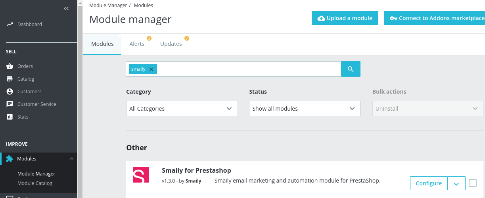
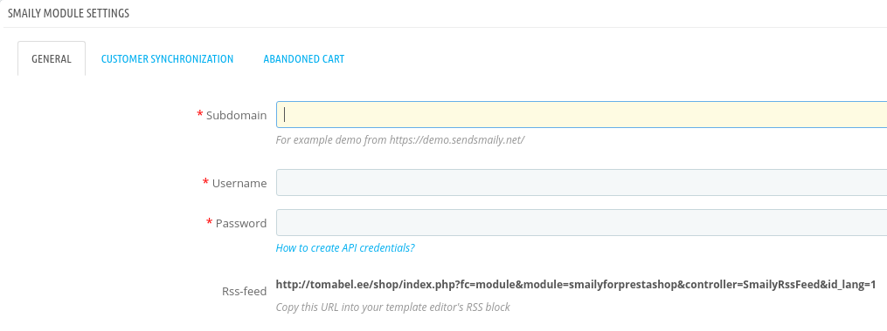
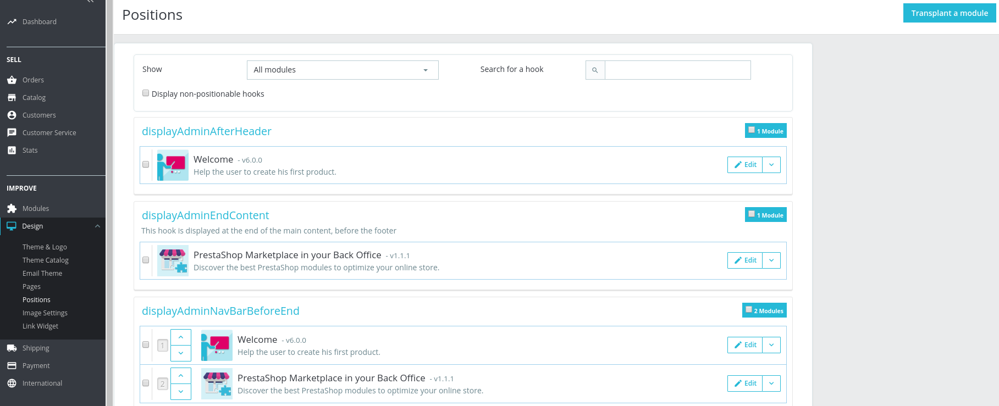
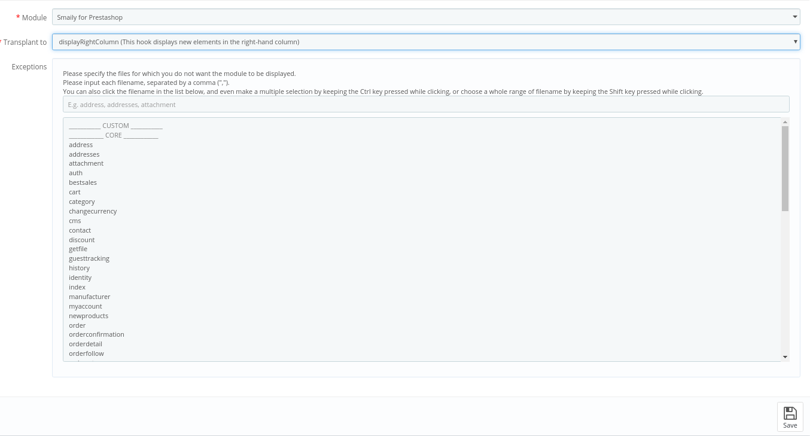
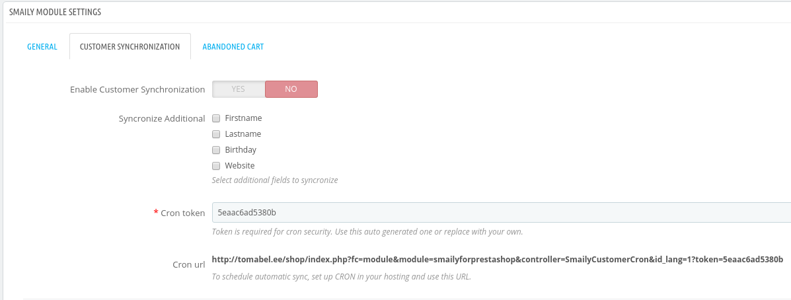

# USER GUIDE

This guide will help you set up and configure Smaily email marketing and automation module for Prestashop.

## Installation
1. You can get the **Smaily for Prestashop module** from Smaily's [GitHub repository](https://github.com/sendsmaily/smaily-prestashop-module/releases).

2. Download the .zip file for the latest release. Extracted contents of the archive to a `smailyforprestashop` folder.

3. Upload the `smailyforprestashop` folder to your site's `/modules/` directory.

4. Navigate to **Modules -> Module Catalog**. Search for "smaily" and click **Install**.

## Connecting module to Smaily account

1. To start using Smaily extension navigate to **Modules -> Module Manager** section. On the configuration page, find **Smaily for Prestashop**, then click on **Configure**.

2. You will be presented with a configuration page for entering your Smaily API credentials - **subdomain, username, and password**.
You must create your API account in Smaily first. You can follow our [tutorial](http://help.smaily.com/en/support/solutions/articles/16000062943-create-api-user) to create one.

3. After that, you can **validate connection** by saving configuration.

## Adding Smaily newsletter subscription form to your store

Smaily's module can synchronize customers, who have opted in for a newsletter subscription during registration.
We however recommend you place a Smaily form on your website, to collect subscribers directly.
1. Navigate to **Design -> Positions** and click on **Transplant a module**.

2. Select **Smaily for Prestashop** for **Module** and the preferred form location for **Transplant to**.

3. Click **Save** and the Smaily newsletter form should be on your store at the specified location!

## Customer synchronization

Registered customers, who have opted for the newsletter will be added to Smaily's subscriber database during synchronization.
1. Enable automatic customer synchronizationn feature under **Customer synchronization** section.
2. There is an option to import **additional fields** available from the store into Smaily to personalize newsletter emails.
3. The synchronization can be automated using the cron URL. Recommended synchronization interval is once a day or less.

## Abandoned cart emails

1. Enable abandoned cart emails feature under **Abandoned Cart** section to send cart reminder emails to store customers.

2. You need to create *form submitted* workflow in Smaily prior to activating this feature. You can follow our [creating automation workflows tutorial](http://help.smaily.com/en/support/solutions/articles/16000092458-creating-automation-workflows).

3. After creating an automation in Smaily you can find this automation under **Autoresponder**.

4. You can **choose timing** when cart is considered abandoned, minimum time 15 minutes.

5. There is also an option to **add additional fields** about abandoned carts to send personalized reminder emails.

